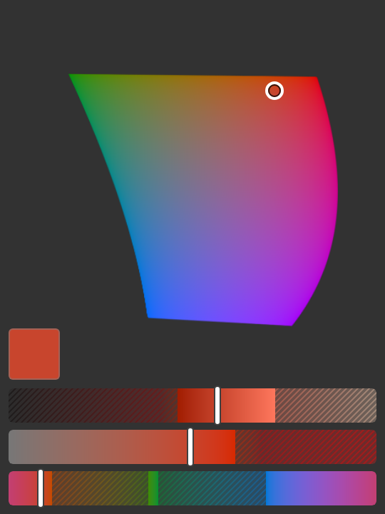

# OKLCH — colour tools for Photoshop

Two UXP panels for Adobe Photoshop built on **OKLCH**, the perceptual
lightness / chroma / hue model.

- **OKLCH** picks colours, and shows you exactly which of them fit inside the
  current document's colour space.
- **OKLCH Underpaint** takes a finished value drawing into colour: you describe
  the light in the scene and it builds the gradient maps and masks that put it
  there, without moving a single value.



## Requirements

- Photoshop 2026 (version 27) — the manifest accepts 26.0.0 and up, so
  Photoshop 2025 works too.
- Nothing else. There is no build step and there are no dependencies; the
  plugin is plain HTML, CSS and JavaScript.

## Installing

### With the UXP Developer Tool (recommended while iterating)

1. Install the [UXP Developer Tool](https://developer.adobe.com/photoshop/uxp/2022/guides/devtool/)
   and start Photoshop.
2. In UDT, **Add Plugin…** and select this repository's `manifest.json`.
3. Press **Load**. Both panels appear under **Plugins → OKLCH**.

`Load` again after editing a file, or use UDT's **Watch** to reload on save.

### Manually

Copy the whole repository into Photoshop's developer plugin folder and restart
Photoshop:

| Platform | Folder |
| --- | --- |
| macOS | `~/Library/Application Support/Adobe/UXP/Plugins/External/okpicker` |
| Windows | `%APPDATA%\Adobe\UXP\Plugins\External\okpicker` |

Loading unpackaged plugins requires developer mode: in the Creative Cloud
desktop app, **Preferences → Apps → Enable "Allow plugins from unknown
sources"** (Photoshop's **Plugins → Plugins Panel** lists what it found).

To hand the plugin to someone who is not a developer, package it as a `.ccx`
with [UPIA](https://developer.adobe.com/photoshop/uxp/2022/guides/distribution/)
(`upia package .`); the layout here is already what UPIA expects.

## The picker

### What it gives you

- **It *is* the foreground colour.** The panel is bound to Photoshop's
  foreground swatch in both directions: move anything in the picker and the
  foreground changes as you drag, change the foreground anywhere else in
  Photoshop and the picker follows. There is nothing to apply and nothing to
  pick up.
- **A C/H diagram shaped like the gamut.** Not a square, not a colour wheel: at
  the current lightness the panel solves for the maximum chroma at every hue and
  paints only the colours the document can actually hold. The silhouette *is*
  the gamut slice, so you can see at a glance that (say) sRGB has plenty of
  chroma in the reds and almost none in the cyans at high lightness. The picture
  is cropped to the gamut's own extent, so the shape fills it instead of
  floating inside a square.
- **A track for each axis** — L, C and H — each painted as a live ramp of the
  colours you would get by moving it, with the out-of-gamut stretch dimmed and
  hatched.
- **Chroma held on the gamut hull.** Moving lightness or hue slides the colour
  along the edge of what the document can hold rather than letting it drift
  outside, so what you see is always what you get.
- **Gamut awareness that follows the document.** The panel reads the frontmost
  document's ICC profile and reshapes itself for sRGB, Display P3,
  Adobe RGB (1998), ProPhoto, Rec. 2020, Wide Gamut RGB, Apple RGB,
  ColorMatch, eciRGB v2 or Rec. 709 — and re-reads it by itself whenever the
  document, its profile or its mode changes.
- **Colour-managed hand-off.** The colour goes to Photoshop as D50 Lab, so the
  swatch matches the colour you picked no matter what the document's working
  space is.
- **Fits the space it is given.** Everything is sized to the panel, so the whole
  picker stays reachable in a narrow Photoshop side panel without scrolling. The
  tracks sit on the bottom edge and the diagram centres itself in whatever is
  left, so a tall dock gets a balanced picture rather than a pool of empty space
  under the controls.

### Using it

| Control | What it does |
| --- | --- |
| Diagram | Click or drag to set chroma (distance from the neutral point) and hue (angle, 0° at 3 o'clock, counter-clockwise). |
| Top track | Lightness. The diagram is redrawn for the new slice. |
| Middle track | Chroma, up to the largest the space can hold anywhere. |
| Bottom track | Hue, right round the circle. |
| Swatch | The colour you are on, which is also Photoshop's foreground colour. It sits at the left, just above the lightness track. Pressing it does nothing — it reports the colour, it does not set one — though a drag begun on the diagram keeps tracking across it. |

Both the diagram and the tracks write straight through to the foreground
swatch, live, while you drag.

### How the gamut is computed

OKLab is defined against linear sRGB at D65. For any other working space the
panel builds the RGB→XYZ matrix from the space's primaries and white point,
Bradford-adapts it to D65, and folds the whole chain into a single 3×3 matrix
applied to the cube-rooted LMS values — so testing whether an OKLCH triple fits
in the gamut is one matrix multiply and three range checks.

The gamut body is star-shaped in chroma at a fixed L and H, so the maximum
chroma is found by bisection (~20 iterations, exact to ~10⁻⁷). The diagram
samples that limit at 720 hues and interpolates, which also gives the outline
its anti-aliased edge. A worst-case repaint — the lightness axis moving, so the
diagram and all three ramps are stale at once — costs around ten milliseconds,
so every frame is drawn at full resolution and there is no draft pass to flicker
through.

The scale is fixed per space rather than per slice, so it does not shift under
you as you move lightness. The diagram is a window onto the OKLab a/b plane, and
that window is the space's whole gamut swept over every lightness and hue, plus
2% headroom — not a square drawn to the largest chroma in any direction. The
difference matters because the two are nothing like the same shape: sRGB reaches
`b = −0.31` towards blue but only `+0.20` towards yellow, so the square left its
top fifth permanently empty. Cropping to the real extent cuts the never-painted
band from 21.5% of the height to 3%, and shows the hull 1.2× larger in the same
number of pixels.

A single slice still does not fill the window — at L = 0.57 about 17% of the
height is above the shape — because the window has to stay put while the slice
grows and shrinks. That is the price of a stable scale.

The corners are a different matter: a rounded hull in a rectangle leaves them
empty for good, which is what lets the swatch overlap the diagram and cost no
layout space at all. The swatch is pinned to the controls — bottom left, just
above the lightness track — so it holds still while the diagram floats above
it, and on a short panel the two meet in the diagram's bottom-left corner.

To be sure that corner really is free, the panel projects the whole gamut onto
the a/b plane — the largest chroma each hue reaches at *any* lightness — and
bisects for the biggest bottom-left square that projection misses. Most RGB
spaces lean away from blue-green and leave a quarter of the width clear
(sRGB: 30%), which is more than the swatch needs at any usable panel size.
ProPhoto is the exception: its imaginary primaries reach into that corner, so
it gets a smaller badge.

### Things worth knowing

- **The panel is not colour managed.** Photoshop paints UXP panels as sRGB, so
  colours the document can hold but sRGB cannot are drawn clipped — in the
  diagram, in the ramps and in the swatch alike. The *shape* is always the
  document's true gamut; the fill is the closest sRGB can show.
- **CMYK, Grayscale, Lab, Indexed and Duotone documents**, and RGB documents
  with a profile the panel does not recognise, fall back to sRGB for the
  diagram. Their gamuts are defined by an ICC profile that a UXP plugin cannot
  evaluate, so a shape drawn for them would be a guess. The colour itself is
  still sent as Lab and converted by Photoshop, so the foreground swatch is
  correct either way.
- Writing the colour uses `labColor`, which Photoshop converts into the
  document's space. If that call fails the panel retries with the document's
  RGB values.
- Writes while you drag **coalesce**: at most one is ever in flight, and the
  next one carries whatever the state has become by then. The picker ignores
  the notification its own write comes back as, so the two directions of the
  binding cannot chase each other.

## The underpaint panel

This one is for a single step of a painting: the pass where a finished value
drawing becomes colour. The usual way to do it is a stack of gradient maps in
hard light or soft light, each masked to a part of the picture — warm where the
light falls, cool where it does not — and the fiddly part is not the idea, it is
the bookkeeping. Every gradient has to be built by hand, every mask drawn by
hand, and changing your mind about the time of day means doing all of it again.

The panel is that step at the level you actually think about it. You describe
the light: a cool ambient filling the shadows, a warm sun coming in from the
upper left, a lamp over here reaching about this far. It writes the gradient
maps and the masks.

### What a light is

Three things, and each one becomes a different part of the layer stack.

| | | Becomes |
| --- | --- | --- |
| **Colour** | an OKLCH hue and chroma — no lightness, because lightness belongs to the drawing | the colours in the gradient |
| **Tones** | the part of the value range it lives in: shadows, midtones, lights, or all of them, and how far it reaches | the shape of the gradient |
| **Place** | everywhere, a disc around a point, or a wash in from one side | the layer mask |

Four kinds set sensible defaults for all three. **Ambient** is everywhere and
fills the shadows — sky, room, the light with no source. **Sun** is a wash from
one direction that only shows where the drawing is already lit. **Lamp** is a
source in the scene and colours everything within its reach. **Spot** is a local
light that only catches the lit side of what it falls on. Each kind is a
starting point; every one of the three parts stays editable afterwards.

A **palette** is a whole rig of them — Golden hour, Overcast, Candlelight,
Moonlight, Sunset, Studio, Underwater, Neon night — already placed and pointed
at the right end of the value range. Two knobs move the whole scheme at once:
**hue shift** rotates every light together, keeping the relationships between
them, and **chroma** scales the lot.

### Using it

| Control | What it does |
| --- | --- |
| The strip at the top | The whole value range, put through the scheme. It is drawn at the point marked in the frame below, and dragging along it moves the value the frame is drawn at. |
| The frame | Where the light falls, on a stand-in drawing running light at the top to dark at the bottom. Drag a light's handle to move it — a ring shows how far a disc reaches, a dot on the edge shows which way a wash comes from. Click anywhere else to move the probe the strip is read at. |
| The list | Every light in the scheme, bottom layer first. Click to select, click the *on* / *off* at the right to switch one out without deleting it — it is still built, as a hidden layer. |
| **Build** | Makes the layers. |
| **From layers** | Reads the scheme back out of the layers already in the document. |

**Build** puts one gradient-map adjustment layer in the document per light, in
the blend mode that light was solved for, masked to where it falls. The mask is
the light's own falloff written into it pixel by pixel — the same function the
frame preview draws, not a redrawing of it with the gradient tool, which since
Photoshop 2023 makes a gradient *fill layer* rather than painting anything.
More than one and they go in a group named after the scheme, in pass-through so
they reach the drawing underneath. It is one history state, so one undo takes all of it
back.

Press it again and it *replaces* what it made rather than stacking a second copy
on top: the group is tracked by layer id, which Photoshop keeps in the file, and
by name if the id has gone. So the loop is press Build, look at the picture,
move a light, press Build again — which is the whole point of designing this at
the level above the gradients.

### The scheme is the document

What you edit is a small object — a name, two scheme-wide knobs, and a list of
lights — and there is exactly one copy of it: the layers themselves. Every layer
the panel builds is called what the light is called, followed by the light:

```
Street lamp [oklch1 k=lamp h=196 c=0.1 t=all r=0.5 g=rad x=0.24 y=0.6 z=0.36 f=0.85]
```

and the group carries what applies to all of them:

```
Neon night [oklch1 pl=neon bl=hard ch=1.15 hu=25]
```

A UXP plugin has no way to write anything of its own inside a PSD, and layer
names are the one field that both travels with the file and can be read back —
so this is the copy that survives being handed to somebody else, or being opened
on a machine that has never seen the document before. Opening a document reads
it, and **From layers** reads it again on demand. Each layer carries its own
light rather than the group carrying all of them, which is what makes it scale:
the whole scheme on one name would run out of room at about four lights.

A light **switched off** is built anyway and its layer hidden, because a hidden
adjustment layer does nothing — it is off in every sense the document has, and
it is still there to be switched back on. That is also how it works the other
way: hide one of the layers in Photoshop, press **From layers**, and the panel
has it switched off. It is still solved against the lights below it as though it
were on, so switching it on gives what the panel designed rather than something
stale.

The fields are named rather than positional so the result is something you can
read — and change — in the Layers panel: set `h=196` to `h=210` by hand, press
**From layers**, and the panel has it. Anything it does not recognise is
ignored, so a light from a later version of the plugin degrades to its defaults
rather than failing, and a layer renamed past recognition drops out of the
scheme instead of breaking the rest of it. Renaming the readable half is free —
`the street lamp [oklch1 …]` is still that light, now called that.

| | | | |
| --- | --- | --- | --- |
| `k` | kind | `h` | hue |
| `c` | chroma | `t` | tones |
| `r` | reach | `g` | shape |
| `x` `y` | place | `z` | size |
| `f` | falloff | `a` | angle |
| `b` | blend, when the light overrides the scheme's | | |
| `pl` | palette | `bl` | blend |
| `ch` | chroma, whole scheme | `hu` | hue shift |

Everything in a scheme is held to a step finer than the panel can show — a
degree of hue, a thousandth of chroma, a thousandth of the frame — so this round
trip is exact rather than nearly exact.

Nothing is kept anywhere else. There is no copy in the plugin's own storage that
could be ahead of the document or behind it, and nothing to reconcile: what the
layers say is what the scheme is. The cost is that **an edit you have not built
is not saved anywhere** — change your mind about a light, switch documents
without pressing **Build**, and the change is gone. Building is one press and
one undo, so the habit is cheap.

**Save…** and **Load…** are the same scheme as a JSON file, for moving one
between paintings or keeping a set of your own. They are export and import
rather than storage: loading one does not touch the document until you build it.

### How the lightness survives

A gradient map over a grey underpainting is an unusually tractable thing. The
ramp position Photoshop looks a stop up by *is* the tone underneath it, so for
every stop the blend's base is known exactly — which means the blend can be run
backwards. For a separable mode each channel is a one-dimensional equation:

```
result = mode.apply(base, stop)     ⟶     stop = mode.invert(base, result)
```

So the panel does not choose gradient colours and hope. It says what the
*result* should be — this tone's own OKLab lightness, that hue, that much chroma
— and solves for the stop that produces it. Every stop, in the document's own
working space and encoded values, which is what Photoshop actually blends.

That is also why the blend modes on offer are the ones they are. Multiply can
only darken and screen can only lighten, so neither can hold lightness still
while adding colour; asked to, they solve to no colour at all. What is left is
**normal** plus the four contrast modes that pivot about mid grey — **soft
light**, **overlay**, **hard light** and **linear light** — which differ in how
far they can push before they run out of room. Chroma you ask for is a wish, not
a promise: it is cut back to what the document's gamut holds at that lightness
and then to what the mode can still reach from that tone, and the panel draws
what survived rather than pretending. Soft light in the deep shadows is the
extreme case; it can barely move at all.

Stops are spaced evenly in *lightness* rather than along the value axis. The
bottom of that axis is savagely compressed — the whole climb out of black is the
first 3% of it — and a ramp sampled evenly across it puts one stop over the
range where a colour cast is most visible. Photoshop lets a stop sit wherever it
likes, so they go where the eye is. Both ends are eased to no chroma at all,
because the gamut narrows to a point at black and at white and a light left
riding the hull until it hits the end snaps to grey over the last few levels,
which is a band you can see.

### Stacking

Layers above the first have two complications, and the panel solves both rather
than living with them. A gradient map reads its input from the *luminosity* of
the composite below it, so once a layer has put colour into the picture the next
one up is no longer looking up the tone it was designed against; and its blend
base is that composite rather than a flat grey. So the layers are compiled in
order, bottom first, each one solved against what will actually be underneath
it. Each light adds its own chroma to what the ones below put down and pins
lightness back to the tone underneath — lights add up, and the drawing's values
come through the whole pile.

That is exact where every mask is fully open. Where one is not, the layer above
is standing on something slightly different from what it was solved for. The
panel measures the error and prints it under the strip — *value held to 0.2%* —
and across the built-in palettes, at every mask coverage, the worst case is
1.6%, which is four levels out of 255. This is also why the light that reaches
everywhere belongs at the bottom of the stack: it is the one thing that is never
masked away, so it is the only safe thing for the rest to stand on. **Down** and
**Up** on a light move it, and the list is in stacking order.

### Things worth knowing

- **The document must be RGB.** A grayscale document cannot hold colour at all;
  convert it to RGB first and the panel will say so until you do.
- **The stops are the document's own values**, worked out in the working space
  the panel matched from its ICC profile. A profile it does not recognise falls
  back to sRGB, exactly as the picker does.
- **An active selection is dropped** before the layers are made — Photoshop
  builds a new layer mask out of whatever is selected, which would cut every
  one of them to that shape. It happens inside the same history step, so undo
  puts the selection back.
- **A build that fails takes itself back out.** Every layer is checked once it
  is made: that it really is a gradient map, and that its blend mode took. If
  either is wrong the build stops and deletes what it had made rather than
  leaving the document half changed — because the failure that matters here is
  silent. The ramps are mid grey wherever a light does nothing, since mid grey
  is what "leave this tone alone" means to the contrast modes, so the same ramp
  left in normal mode maps every tone to grey and flattens the drawing.
- The layers are ordinary gradient maps and ordinary masks. Nothing about them
  depends on the panel: open one in the gradient editor and edit it by hand if
  you like. Building again will overwrite it, so keep hand edits above the
  group — which is where the rest of the painting goes anyway.

## Development

```sh
npm test        # colour maths, blend inversion, lighting schemes, renderers
npm run icons   # regenerate icons/ — they are rendered by the panels' own code
```

`index.html` opens directly in a browser for UI work: the Photoshop bridge
degrades to a no-op, so the picker starts on its default colour and writes go
nowhere, and the underpaint panel runs on a stand-in 4:3 frame with **Build**
switched off — but everything else behaves exactly as it does in Photoshop,
including the way the picker's layout compacts itself as you resize the window.
Both panels are in the one document, so a switcher appears at the top to pick
between them; in Photoshop that bar is never built.

### Layout

| Path | Contents |
| --- | --- |
| `manifest.json` | UXP manifest (manifest version 5, two panel entry points). |
| `index.html` | The picker's markup, an empty root for the underpaint panel, and the scripts in load order. |
| `src/color.js` | OKLab/OKLCH, working-space matrices, transfer functions, gamut search, Lab, profile-name matching. No DOM. |
| `src/render.js` | Pixel generators: the gamut diagram, the axis ramps, colour strips and sampled fields. |
| `src/png.js` | RGBA → PNG → data URI, for hosts without a working canvas. |
| `src/dom.js` | Shared browser plumbing: the pixel surface, the drag binding, and mounting a subtree into the root node a panel entry point is given. |
| `src/ps.js` | Host bridge: document, swatches, notifications, modal execution, the layer tree, file dialogs. |
| `src/ui.js` | The picker: state, the foreground binding, repaint scheduling, layout. |
| `src/blend.js` | Blend modes forwards and backwards, and the stop solver that holds lightness. No DOM. |
| `src/scheme.js` | The lighting scheme: kinds, tonal profiles, mask shapes, palettes, and both of its written forms — JSON, and the tokens in the layer names. No DOM, no Photoshop. |
| `src/gradient.js` | The compiler: a scheme in, gradients and mask geometry out, plus the simulation the previews are drawn from. |
| `src/apply.js` | Building the plan in the document: adjustment layers, mask pixels, grouping, replacing what was there before, and checking that what was asked for is what got made. |
| `src/underpaint.js` | The underpaint panel: its markup, its two previews and its controls. |
| `test/` | Unit tests for everything above the DOM. |

The renderers write into an RGBA buffer and the panels decide where it goes:
they probe the host's canvas by round-tripping a `putImageData`, and fall back
to an `` fed by the built-in PNG encoder if that probe fails.

A plugin with one panel shows it the document's body. With two, the host hands
each entry point its own root node instead, and `src/dom.js` moves the matching
subtree into whichever node arrives — accepting either shape of lifecycle
argument, since manifest v4 and v5 differ on it, and leaving the document alone
when no node ever comes.

The hand-over is the part worth knowing about, because getting it wrong shows up
as a plugin with nothing in it. `uxp.entrypoints.setup` may be called **once**,
and that once has to carry **every** panel the manifest declares: it throws both
on a second call and on data that does not match. A plugin that registers its
panels one file at a time therefore ends up with none of them, and since a
plugin with more than one panel is no longer shown the document's body, both
panels come up blank. So `src/dom.js` collects the panels as they mount and
hands them over together, in a task queued from `DOMContentLoaded` — after every
script in the document has run, and after any panel that mounts in a
`DOMContentLoaded` handler of its own. A microtask is not late enough: each
script tag is its own turn and microtasks drain at the end of each one, so a
microtask armed by the first panel's script fires before the second panel's
script has been read.

## Licence

Apache 2.0 — see [LICENSE](LICENSE).
